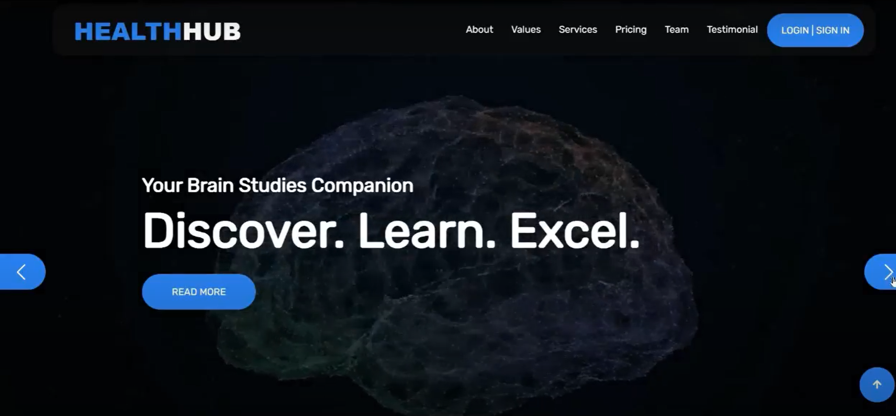
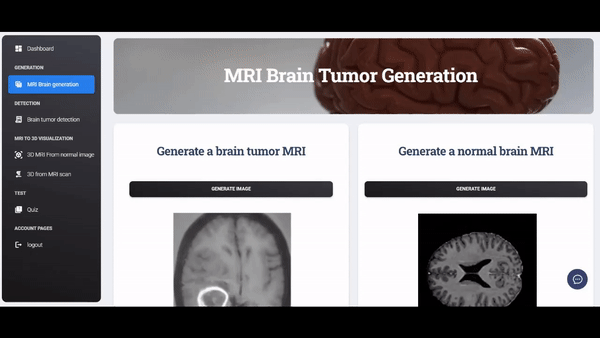
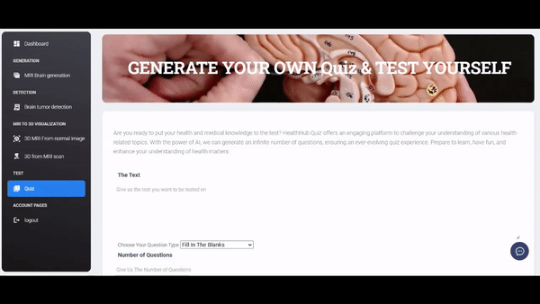
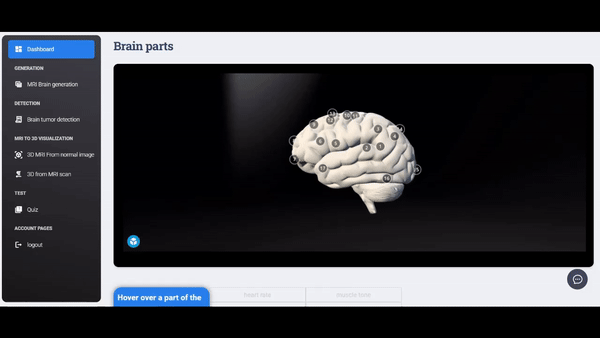

# HealthHub , your companion to medical education



## Introduction

This is HealthHub , a web application designed for medical professionals and students, providing a comprehensive set of tools and features for learning and practicing various aspects of medical imaging and diagnostics. Built with Flask, it offers the following key features:

1. **Brain MRI Image Generation**:
    - Generates brain MRI images with tumors using a stable diffusion model and Dream Booth technology.
    - Generates brain MRI images of healthy brains with GAN for comparative analysis.
   


2. **Quiz Generator**:
    - Allows users to enter text or medical case descriptions.
    - Utilizes AI to automatically generate quizzes based on the input.
    - Calculates and displays quiz scores to assess the user's understanding.
  



3. **3D Brain Visualization from**:
    - One model for displaying 3D MRI in detail using JPEG format as input.
    - Another model for tumor detection and 3D brain visualization using flair.nii and t1ce.nii files.
    - Includes the visualization of tumors in the 3D brain model.

4. **3D Brain segmentation**:
    - Utilizing .nii files.
    - 3D brain segmentation performs a comprehensive brain segmentation.
    - Extracts tumors.
    - Converts them into a three-dimensional format.
    - Allows for subsequent slicing.

5. **Brain Tumor Detection**:
    - Performs brain tumor detection with classification into different types.
    - Utilizes advanced machine learning algorithms for accurate diagnosis.

6. **Medical Chatbot**:
    - Acts as a virtual professor.
    - Answers all questions related to healthcare.


## Getting Started

### Prerequisites

- Python 3.x
- Flask (install via `pip install Flask`)
- Additional Python libraries and dependencies required for image generation, AI, and visualization (please provide installation instructions if needed).

## ✨ How to use it

> Download the code 

```bash
$ git clone https://github.com/yahyasamet/HealthHubv2.git
$ cd HealthHubv2
```

<br />

### 👉 Set Up for `Windows` 

> Install modules via `VENV` (windows) 

```
$ python venv venv
$ .\venv\Scripts\activate
$ pip install -r requirements.txt

and you should install the Gan model from here https://huggingface.co/spaces/yahyasmt/Brain-MR-Image-Generation-with-StyleGAN/tree/main
you copy the file brainmrigan.pkl and make it in to HealthHubv2 folder
```

<br />

> Set Up Flask Environment

```bash
$ # CMD 
$ set FLASK_APP=run.py
$ set FLASK_ENV=development
$
$ # Powershell
$ $env:FLASK_APP = ".\run.py"
$ $env:FLASK_ENV = "development"
```

<br />

> Start the app

```bash
$ flask run
```

At this point, the app runs at `http://127.0.0.1:5000/`. 

<br />

